### ☁️ AWS RDS Setup: PostgreSQL Instance & Security Group

To enable remote SQL query execution from DataGrip, this project uses a PostgreSQL instance hosted on **Amazon RDS**. First create a PostgreSQL RDS instance, and then configured security group for external access.

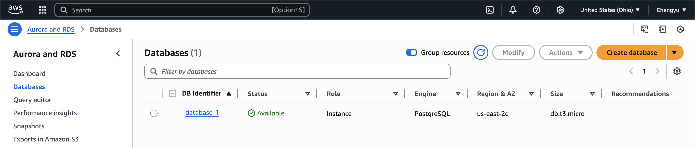


---

### Query 1: People Whose Names Start with ‘A’ and Are 5 Characters Long

**🧾 Task**:  
Print the name of all people whose name starts with ‘A’ (case-sensitive), does not end with the lowercase characters 'e' or 'n', and contains exactly 5 characters. Eliminate duplicates (names of actors are not necessarily unique), and print the result in alphabetical order.

**💡 SQL Strategy**:
- Use `LIKE 'A%'` for prefix.
- Use `LENGTH(name) = 5` and `NOT LIKE '%e' OR '%n'` for suffix exclusion.
- Apply `DISTINCT` + `ORDER BY`.

**🧠 SQL Code**:
```sql
SELECT
    DISTINCT name
FROM
    people
WHERE
    name LIKE 'A%'
    AND LENGTH(name) = 5
    AND NOT (name LIKE '%e' OR name LIKE '%n')
ORDER BY
    name;
```

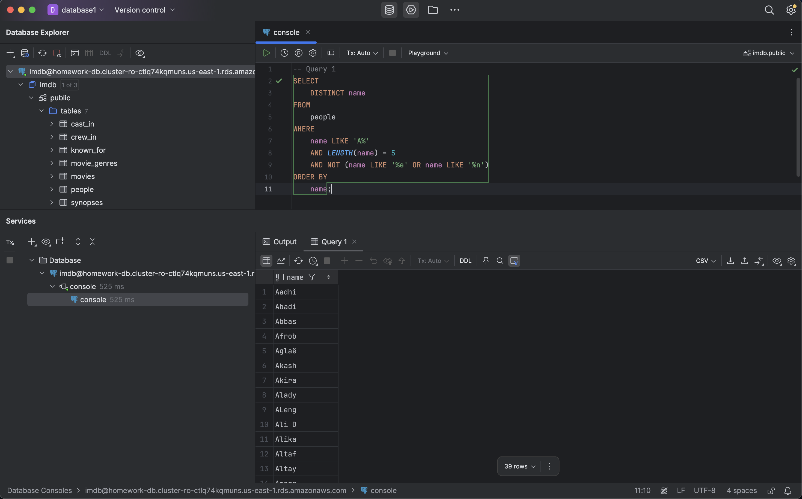

---

### Query 2: Directors with Movies Rated ≥ 7 After 2000

**🧾 Task**:  
Print the id and name of all directors who have directed some movie whose rating is greater than or equal to 7 and was released after 2000 (2000 not included). Directors are people in crew_in with job = ‘director’. Eliminate duplicates

**💡 SQL Strategy**:
- Use `DISTINCT` to remove duplicates

**🧠 SQL Code**:
```sql
SELECT
    DISTINCT p.id, p.name
FROM
    crew_in c
    JOIN people p ON c.person_id = p.id
    JOIN movies m ON c.movie_id = m.id
WHERE
    c.job = 'director'
    AND m.rating >= 7
    AND m.release_year > 2000;
```
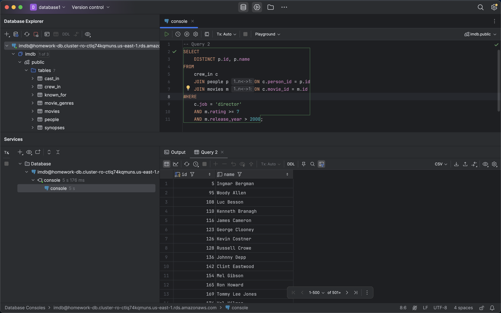

### Query 3: Prolific Actors in Highly-Rated Movies

**🧾 Task**:  
For all people who have acted in more than 10 movies that have more than 100k ratings, print their id and name, and the average rating and number of such movies. Order by the number of movies (num_movies) from highest to lowest and secondarily order by name in ascending order. Round average rating to two decimal points.

**💡 SQL Strategy**:
- Use `ROUND(AVG(...), 2)` to round average ratings
- Sort using `ORDER BY num_movies DESC, name ASC`

Round average rating to two decimal points using the ROUND function.

**🧠 SQL Code**:
```sql
SELECT
    p.id,
    p.name,
    ROUND(AVG(m.rating), 2) AS avg_rating,
    COUNT(*) AS num_movies
FROM cast_in c
    JOIN movies m ON c.movie_id = m.id
    JOIN people p ON c.person_id = p.id
WHERE
    m.num_ratings > 100000
GROUP BY
    p.id,
    p.name
HAVING
    COUNT(*) > 10
ORDER BY
    num_movies DESC,
    p.name;
```
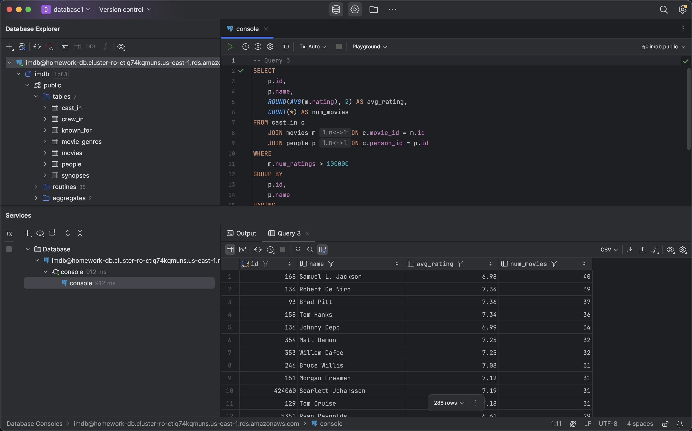

---


### Query 4: Actors Who Did Not Act in Action Movies Since 2000

**🧾 Task**:  
Print the number of distinct people who have acted in at least one movie, but have not acted in any "Action" movie released in or since 2000.


**💡 SQL Strategy**:
- Use `WITH` clause to create two temporary sets: `all_actors`: all actors; `action_actors`: actors in Action movies since 2000
- Use `LEFT JOIN` to subtract the two sets
- Use `WHERE ... IS NULL` to get those who are **not** in the `action_actors` set


**🧠 SQL Code**:
```sql
WITH
all_actors AS (  -- people who have ever acted in at least one movie:
    SELECT DISTINCT c.person_id
    FROM cast_in c
),
action_actors AS (  -- people who have ever acted in "Action" movie released in or since 2000:
    SELECT DISTINCT c.person_id
    FROM cast_in c
        JOIN movies m ON c.movie_id = m.id
        JOIN movie_genres g ON m.id = g.movie_id
    WHERE g.genre = 'Action'
      AND m.release_year >= 2000
)
SELECT
    COUNT(*) AS num_actors
FROM
    all_actors a
LEFT JOIN
        action_actors aa ON a.person_id = aa.person_id
WHERE aa.person_id IS NULL;
```
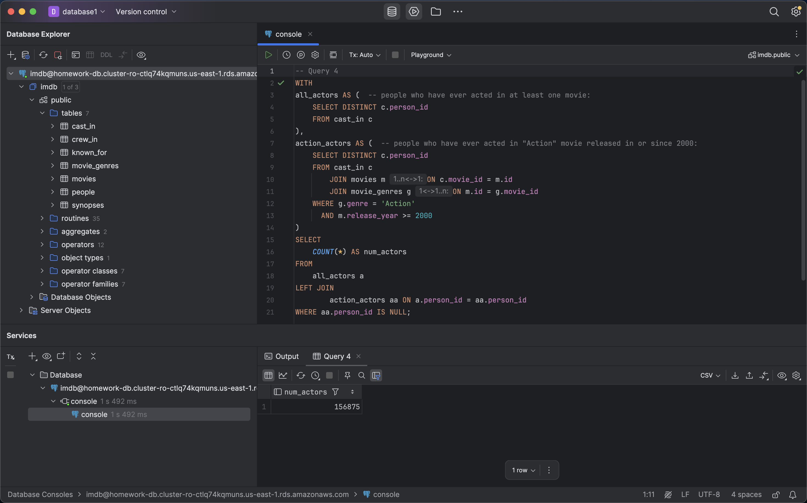

---


### Query 5: Movies Rated Higher Than All Movies by Directors with Exactly 10 Movies

**🧾 Task**:  
Find the titles and ratings of movies that have a higher rating than all movies directed by a director who has directed exactly 10 movies. Recall that a director is someone in crew_in with job = ‘director’, and that if a movie has not yet been rated (num_ratings=0) the rating is NULL.


**💡 SQL Strategy**:
- Use `GROUP BY` and `HAVING COUNT(*) = 10` to find directors who directed exactly 10 movies
- Use `> ALL (...)` to filter higher-rated movies


**🧠 SQL Code**:
```sql
WITH
directors_with_10_movies AS (  -- find the id of the director who has directed exactly 10 movies
    SELECT
        c.person_id AS director_id
    FROM
        crew_in c
    WHERE
        c.job = 'director'
    GROUP BY
        c.person_id
    HAVING
        COUNT(*) = 10
),
director_movies_rating AS (  -- find the rating of 10_movies_directors
    SELECT
        m.rating
    FROM
        directors_with_10_movies d  -- NOTE: JOIN extended directors_with_10_movies table with more columns.
    JOIN
        crew_in c ON d.director_id = c.person_id
    JOIN
        movies m ON c.movie_id = m.id
)
SELECT
    m.title,
    m.rating
FROM
    movies m
WHERE
    m.rating > ALL (  -- rating should higher than all movies in the following subquery:
        SELECT
            dm.rating
        FROM
            director_movies_rating dm
        WHERE
            dm.rating IS NOT NULL -- exclude NULL rating
    );
```
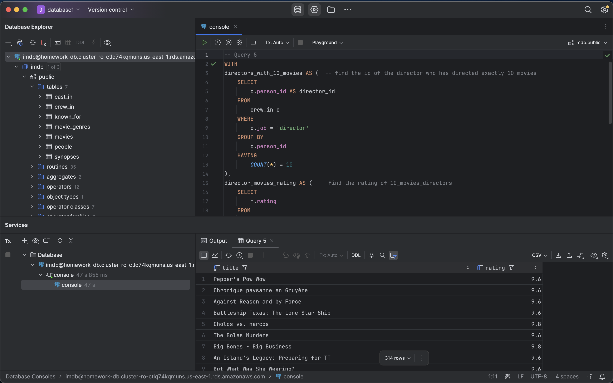

---


### Query 6: Directors with High-Rated Movies and Their Titles

**🧾 Task**:  
For each movie director who has directed at least one movie with more than a million ratings, print the director’s name and a list of all the movie titles this director has directed. The list should separate movie titles by a semicolon and space (‘; ’), and should be in alphabetical order. Order the query result first by the number of movies (descending) and secondly by director id, and name the list of movie titles ‘movies’.


**💡 SQL Strategy**:
- Pre-select eligible directors (`num_ratings > 1000000`)
- Use `STRING_AGG(... ORDER BY ...)` to list titles


**🧠 SQL Code**:
```sql
WITH directors_with_hit AS (
    SELECT DISTINCT c.person_id
    FROM crew_in c
    JOIN movies m ON c.movie_id = m.id
    WHERE c.job = 'director' AND m.num_ratings > 1000000
)
SELECT
    c.person_id AS director_id,
    p.name AS director_name,
    STRING_AGG(m.title, '; ' ORDER BY m.title) AS movies,
    COUNT(m.id) AS movie_count
FROM crew_in c
JOIN people p ON c.person_id = p.id
JOIN movies m ON c.movie_id = m.id
JOIN directors_with_hit dwh ON dwh.person_id = c.person_id
WHERE c.job = 'director'
GROUP BY c.person_id, p.name
ORDER BY movie_count DESC, c.person_id;
```


---


### Query 7: Avg Ratings by Director Experience Level

**🧾 Task**:  
Define the experience level of a director as ‘Rising Star’ if they have directed fewer than 5 movies, and 'Veteran' otherwise. For each experience level, print out the average number of ratings (i.e., the num_ratings column) and the average rating of the movies, considering all movies directed by individuals in that experience category. Replace any null values in the num_ratings or rating columns with 0 when calculating the averages. Round the results to two decimal places, and display them in descending order based on the average number of ratings.

**💡 SQL Strategy**:
- Count movies per director, use `CASE` to assign level
- Join back with `crew_in` and `movies`
- Use `COALESCE` to replace nulls, `ROUND` to format


**🧠 SQL Code**:
```sql
WITH movie_counts_per_director AS (
    SELECT
        c.person_id AS director_id,
        COUNT(DISTINCT c.movie_id) AS director_total_movie_count
    FROM crew_in c
    WHERE c.job = 'director'
    GROUP BY c.person_id
),
experience_level AS (
    SELECT
        director_id,
        CASE
            WHEN director_total_movie_count < 5 THEN 'Rising Star'
            ELSE 'Veteran'
        END AS experience_level
    FROM movie_counts_per_director
)
SELECT
    el.experience_level,
    ROUND(AVG(COALESCE(m.num_ratings, 0)), 2) AS avg_num_ratings,
    ROUND(AVG(COALESCE(m.rating, 0)), 2) AS avg_rating
FROM experience_level el
JOIN crew_in c ON c.person_id = el.director_id
JOIN movies m ON c.movie_id = m.id
WHERE c.job = 'director'
GROUP BY el.experience_level
ORDER BY avg_num_ratings DESC;
```
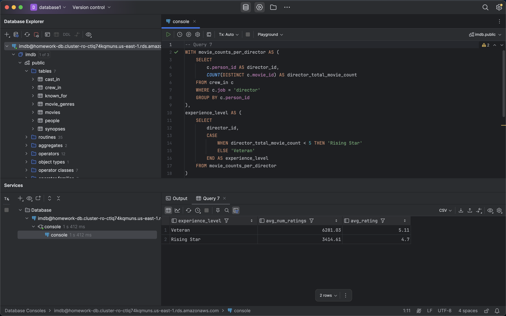

---


### Query 8: Create OpenFlights Database Schema

**🧾 Task**:  
Create three tables — `Airlines`, `Airports`, and `Routes` — in PostgreSQL, based on the OpenFlights dataset.  
Include appropriate:
- `PRIMARY KEY`s  
- `FOREIGN KEY`s  
- A `CHECK` constraint on the `code_share` column in `Routes`


**🧠 SQL Code**:
```sql
CREATE TABLE Airlines (
    id INT,
    name VARCHAR(255),
    alias VARCHAR(255),
    iata CHAR(2),
    icao CHAR(3),
    callsign VARCHAR(255),
    country VARCHAR(255),
    active CHAR(1),
    PRIMARY KEY (id)
);

CREATE TABLE Airports (
    id INT,
    name VARCHAR(255),
    city VARCHAR(255),
    country VARCHAR(255),
    iata CHAR(3),
    icao CHAR(4),
    lat NUMERIC(8,6),
    lon NUMERIC(9,6),
    alt INT,
    timezone NUMERIC(3,1),
    dst CHAR(1),
    tz VARCHAR(255),
    PRIMARY KEY (id)
);

CREATE TABLE Routes (
    airline_iata CHAR(3),
    airline_id INT,
    src_iata_icao CHAR(4),
    source_id INT,
    target_iata_icao CHAR(4),
    target_id INT,
    code_share CHAR(1) CHECK (code_share IN ('Y', '')),
    equipment CHAR(20),
    PRIMARY KEY (airline_id, source_id, target_id),
    FOREIGN KEY (airline_id) REFERENCES Airlines (id),
    FOREIGN KEY (source_id) REFERENCES Airports (id),
    FOREIGN KEY (target_id) REFERENCES Airports (id)
);
```
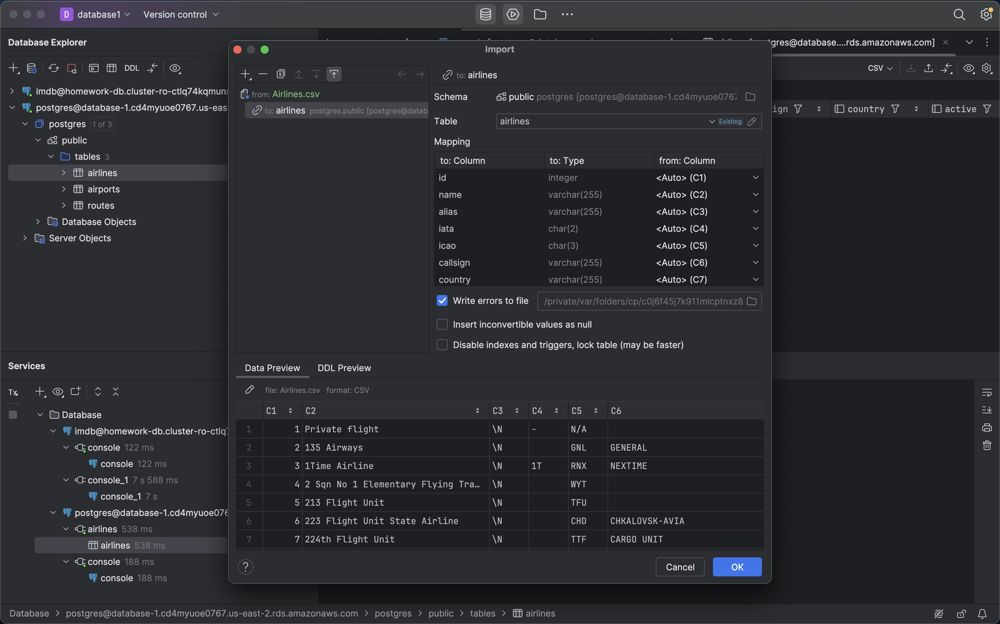
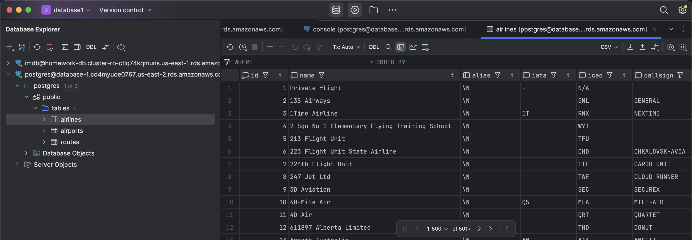


---


### Query 9: Cities with International Airports

**🧾 Task**:  
Print the name and country of all cities that contain an international airport, where an international airport is defined as one that flies to at least 5 different countries. Order by city name (primarily) and country name (secondarily) in alphabetical order.


**💡 SQL Strategy**:
- Join `Airports` with `Routes` and `target Airports`
- Filter where source and target countries are different
- Group by source airport and count distinct destination countries


**🧠 SQL Code**:
```sql
WITH
international_airports AS (
    SELECT
        a.city,
        a.country
    FROM
        Airports a
    JOIN
        Routes r ON a.id = r.source_id
    JOIN
        Airports dest ON r.target_id = dest.id
        AND a.country <> dest.country
    GROUP BY
        a.id,
        a.city,
        a.country
    HAVING
        COUNT(DISTINCT dest.country) >= 5  -- fly to at least 5 different countries
)
SELECT DISTINCT
    city,
    country
FROM
    international_airports
ORDER BY
    city,
    country;
```
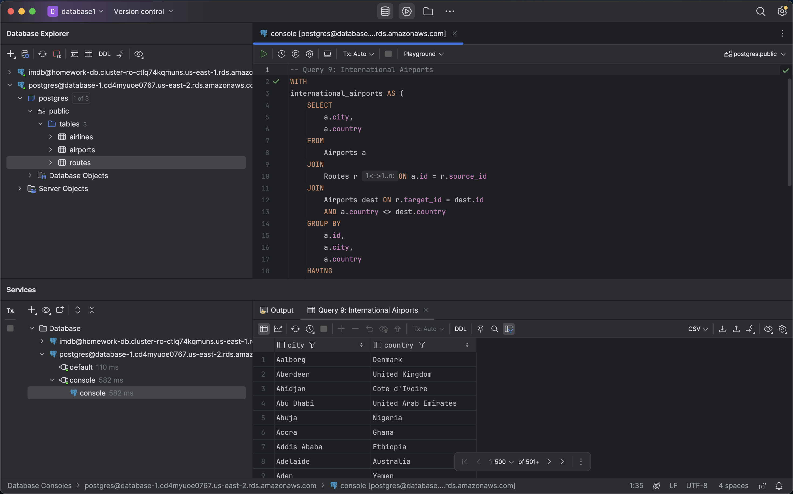

---


### Query 10: Domestic Cities Served by Airlines

**🧾 Task**:  
For each airline, count the number of distinct domestic cities that are sources of some route and number of distinct domestic cities that are targets of some route. Consider only flights where both the source and target airports are within the airline's home country. Print the name of the airline, home country, the number of distinct source cities it serves, and the number of distinct target cities it serves. Order primarily by country and secondarily by the airline name, both in alphabetical order.


**💡 SQL Strategy**:
- Filter where source & target airports are in same country as airline
- Count `DISTINCT source_city` and `DISTINCT target_city`


**🧠 SQL Code**:
```sql
SELECT
    a.name AS airline_name,
    a.country AS home_country,
    COUNT(DISTINCT s.city) AS distinct_source_cities,
    COUNT(DISTINCT t.city) AS distinct_target_cities
FROM Airlines a
JOIN Routes r ON a.id = r.airline_id
JOIN Airports s ON r.source_id = s.id
JOIN Airports t ON r.target_id = t.id
WHERE a.country = s.country AND a.country = t.country
GROUP BY a.id, a.name, a.country
ORDER BY a.country, a.name;
```
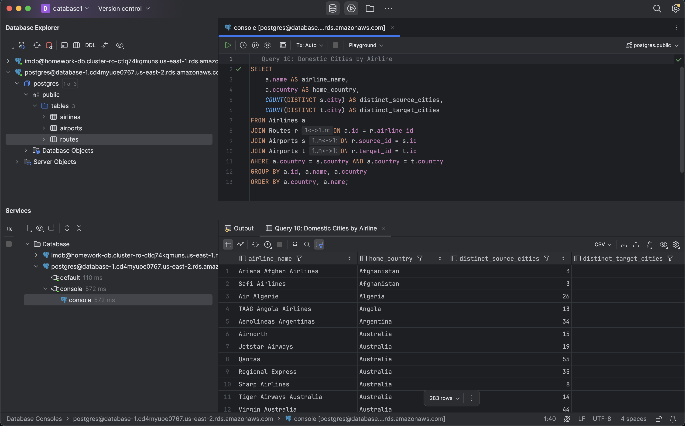

---


### Query 11: Flight Counts Between Kenyan City Pairs

**🧾 Task**:  
For all unique pairs of cities within Kenya, count the number of flights from city A to city B using the routes table, where city A to city B (city A, city B) is considered a different pair from city B to city A (city B, city A). For cities where there are no flights in between, return 0. Order the result by the number of flights in descending order.


**💡 SQL Strategy**:
- Extract all Kenyan cities
- Use `CROSS JOIN` to generate all (A, B) city pairs where A ≠ B
- Count actual flights for each direction using `JOIN`
- Use `LEFT JOIN` + `COALESCE` to return `0` when no flight exists


**🧠 SQL Code**:
```sql
WITH
kenyan_cities AS (  -- find all cities within Kenya
    SELECT DISTINCT city
    FROM airports
    WHERE country = 'Kenya'
),
all_kenyan_pairs AS (  -- find all city pairs in within Kenya
    SELECT
        k1.city AS city_A,
        k2.city AS city_B
    FROM
        kenyan_cities k1
    CROSS JOIN
        kenyan_cities k2
    WHERE k1.city <> k2.city  -- city pair refers to different cities
),
flights_A_to_B AS (  -- find flights from city A to city B
    SELECT
        src.city AS city_A,
        dest.city AS city_B,
        COUNT(*) AS num_flights
    FROM
        routes r
    JOIN
        airports src ON r.source_id = src.id AND src.country = 'Kenya'
    JOIN
        airports dest ON r.target_id = dest.id AND dest.country = 'Kenya'
    GROUP BY
        src.city,
        dest.city
)
SELECT
    kp.city_A,
    kp.city_B,
    COALESCE(fab.num_flights, 0) AS num_flights
FROM
    all_kenyan_pairs kp
LEFT JOIN
    flights_A_to_B fab
    ON kp.city_A = fab.city_A AND kp.city_B = fab.city_B
ORDER BY
    num_flights DESC;
```
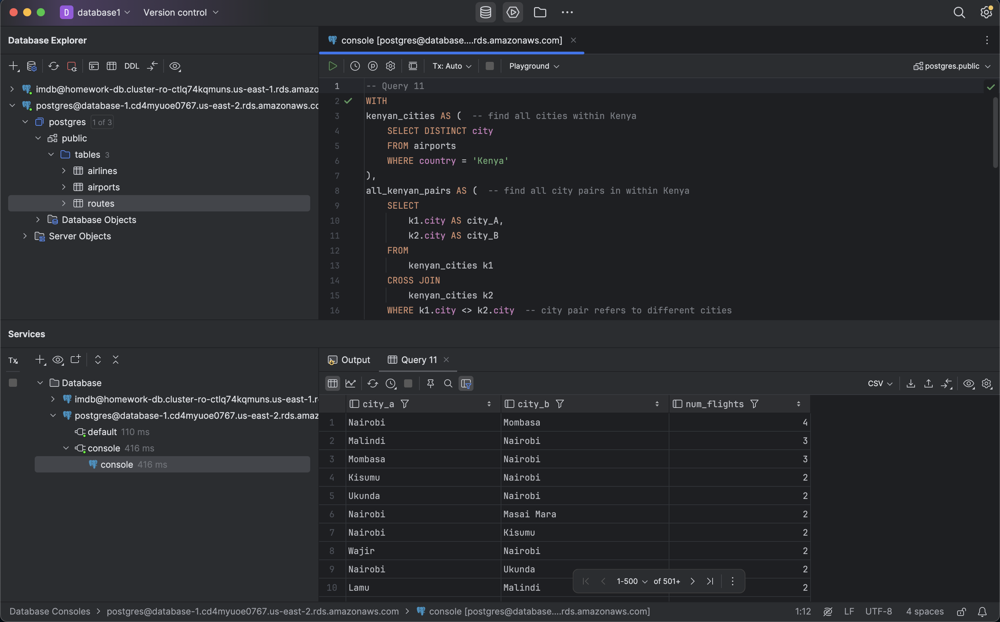

---
### Query 12: All Valid Flight Paths from AUH to JFK (Max 3 Legs)

**🧾 Task**:  
A while ago, you won a free ticket to London’s Heathrow Airport (iata LHR) from anywhere in the world. You are now in Abu Dhabi (iata AUH), and have an emergency that requires you get to JFK Airport in New York City as soon as possible (iata JFK). You want to determine all possible routes to reach JFK using a maximum of two paid flights and optionally using your free ticket. You consider the following scenarios:

1. AUH → JFK (1 flight, paid)
2. AUH → X → JFK (2 flights)
3. AUH → X → LHR (free) → JFK. (3 flights, one of which is free to LHR) Do not consider the case where X is JFK.
4. AUH → LHR (free) → X → JFK. (3 flights, one of which is free to LHR) Do not consider the case where X is AUH.

For each possible route of airports, return the path taken (e.g., “AUH;LHR;JFK”). Return in exactly this format (iatas separated by semicolons, no spaces).

To construct paths, please combine city names. Remember that the query needs to account for different flight combinations, so break it into smaller steps which are the scenarios listed above. Eliminate duplicates, and order by increasing number of flights.


**💡 SQL Strategy**:
- Build 4 CTEs for each scenario
- Use `CONCAT()` to format the path
- Use `UNION` and `GROUP BY` to eliminate duplicates
- `ORDER BY num_flights, path`


**🧠 SQL Code**:
```sql
WITH
scenario_1 AS (
    SELECT DISTINCT
        1 AS num_flights,  -- number of flights is 1
        'AUH;JFK' AS path  -- return the path separated by semicolons
    FROM Routes r
    -- the first leg of the flight:
    JOIN Airports src ON r.source_id = src.id AND src.iata = 'AUH'  -- match routes where the source airport is AUH
    JOIN Airports dest ON r.target_id = dest.id AND dest.iata = 'JFK'  -- match routes where the target airport is JFK
),
scenario_2 AS (
    SELECT DISTINCT
        2 AS num_flights,  -- number of flights is 2
        CONCAT('AUH;', x.iata, ';JFK') AS path  -- return the path separated by semicolons
    FROM Routes r1
    -- the first leg of the flight:
    JOIN Airports src ON r1.source_id = src.id AND src.iata = 'AUH'  -- match routes where the source airport is AUH
    JOIN Airports x ON r1.target_id = x.id  -- match routes where the target airport is X
    -- the second leg of the flight:
    JOIN Routes r2 ON r2.source_id = x.id  -- match routes where the source airport is X
    JOIN Airports jfk ON r2.target_id = jfk.id AND jfk.iata = 'JFK'  -- match routes where the target airport is JFK
    WHERE
        x.iata != 'JFK'
),
scenario_3 AS (
    SELECT DISTINCT
        3 AS num_flights,  -- number of flights is 3
        CONCAT('AUH;', x.iata, ';LHR;JFK') AS path  -- return the path separated by semicolons
    FROM Routes r1
    -- the first leg of the flight:
    JOIN Airports src ON r1.source_id = src.id AND src.iata = 'AUH'  -- match routes where the source airport is AUH
    JOIN Airports x ON r1.target_id = x.id  -- match routes where the target airport is X
    -- the second leg of the flight:
    JOIN Routes r2 ON r2.source_id = x.id  -- match routes where the source airport is X
    JOIN Airports lhr ON r2.target_id = lhr.id AND lhr.iata = 'LHR'  -- match routes where the target airport is LHR
    -- the third leg of the flight:
    JOIN Routes r3 ON r3.source_id = lhr.id  -- match routes where the source airport is LHR
    JOIN Airports jfk ON r3.target_id = jfk.id AND jfk.iata = 'JFK'  -- match routes where the source airport is JFK
    WHERE
        x.iata != 'JFK'
),
scenario_4 AS (
    SELECT DISTINCT
        3 AS num_flights,  -- number of flights is 3
        CONCAT('AUH;LHR;', x.iata, ';JFK') AS path  -- return the path separated by semicolons
    FROM Routes r1
    -- the first leg of the flight:
    JOIN Airports auh ON r1.source_id = auh.id AND auh.iata = 'AUH'  -- match routes where the source airport is AUH
    JOIN Airports lhr ON r1.target_id = lhr.id AND lhr.iata = 'LHR'  -- match routes where the target airport is LHR
    -- the second leg of the flight:
    JOIN Routes r2 ON r2.source_id = lhr.id  -- match routes where the source airport is LHR
    JOIN Airports x ON r2.target_id = x.id  -- match routes where the target airport is X
    -- the third leg of the flight:
    JOIN Routes r3 ON r3.source_id = x.id  -- match routes where the source airport is AUH
    JOIN Airports jfk ON r3.target_id = jfk.id AND jfk.iata = 'JFK'  -- match routes where the target airport is JFK
    WHERE
        x.iata != 'AUH'
)
SELECT
    num_flights,
    path
FROM (
    SELECT * FROM scenario_1
    UNION
    SELECT * FROM scenario_2
    UNION
    SELECT * FROM scenario_3
    UNION
    SELECT * FROM scenario_4
) AS combined
GROUP BY
    num_flights,
    path
ORDER BY
    num_flights,
    path;
```
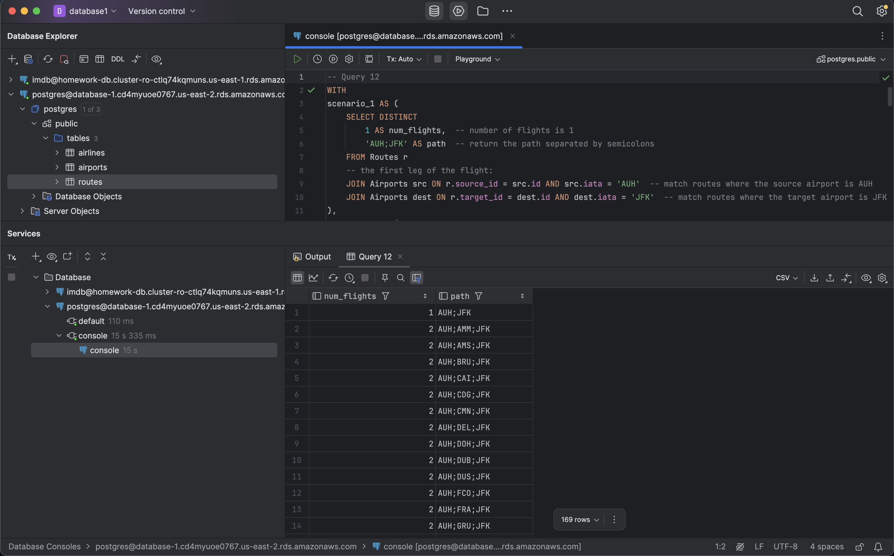


